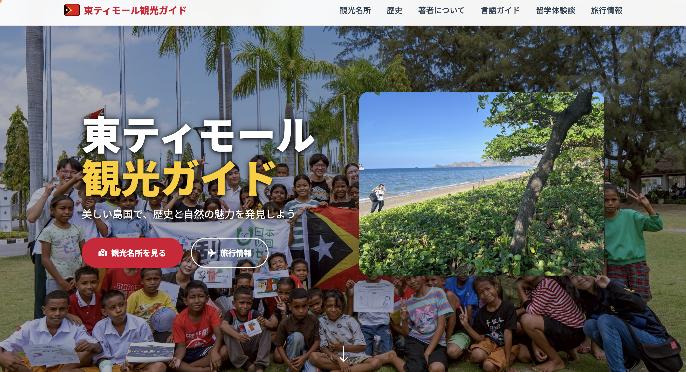

# 東ティモール観光ガイド 🇹🇱



**サイトURL**: [https://oto0928.github.io/EastTimor/](https://oto0928.github.io/EastTimor/)

## 📖 プロジェクト概要

東ティモールの観光情報、歴史、文化を紹介する総合ガイドサイトです。実際の留学体験を基に、現地で役立つ情報やテトゥン語フレーズ、観光スポットの詳細を提供しています。

## ✨ 主な機能

### 🏛️ 観光名所紹介
- **クリストレイ**: 必見の巨大キリスト像と絶景スポット
- **Chega博物館**: 東ティモールの歴史と独立運動を学べる博物館
- **フルーツマーケット**: 地元の活気ある市場体験
- **美しい海**: ダイビング・シュノーケリングスポット
- その他、ティモールプラザ、サンタクルス墓地など

### 📚 歴史コンテンツ
- ポルトガル植民地時代（1515年〜）
- インドネシア占領時代（1975-1999年）
- サンタクルス墓地事件（1991年）
- 独立への道のり（1999年国民投票 → 2002年正式独立）
- 重要人物の紹介（シャナナ・グスマン、ジョゼ・ラモス・ホルタなど）

### 🗣️ テトゥン語ガイド
- **基本挨拶**: ボンディア（おはよう）、オブリガード（ありがとう）など
- **方言と地域文化**: ディリ方言と農村方言の違い
- **便利なフレーズ**: 道案内、買い物、緊急時のフレーズ集
- **数字と基本表現**: 1〜10の数字、時間、日付の表現
- **発音ガイド**: 日本人向けの発音のコツ
- **インタラクティブクイズ**: 学習したフレーズを練習できる機能

### 📝 留学体験談
12日間（2024年9月27日〜10月8日）の東ティモール留学プログラムの詳細な記録：
- **フリースクール活動**: 現地の子どもたちへの授業支援
- **SHARE活動**: ベサヘ小学校でのテント泊体験
- **国際機関見学**: JICA、UNV、日本大使館訪問
- **文化交流**: Jリーグサッカー教室、元大統領補佐官との対話
- **日本財団への感謝**: プログラムを支援いただいた団体への謝辞

### ℹ️ 旅行情報
- ベストシーズン（5月〜10月の乾季）
- 航空券・宿泊情報
- 現地での食事・交通費の目安
- 安全情報とアドバイス

## 🛠️ 技術スタック

- **HTML5**: セマンティックなマークアップ
- **CSS3**: レスポンシブデザイン、モダンなUI/UX
- **JavaScript**: インタラクティブ機能（クイズ、ナビゲーション、アニメーション）
- **Font Awesome**: アイコンライブラリ
- **Google Fonts**: Noto Sans JP フォント

## 📱 レスポンシブデザイン

- デスクトップ、タブレット、スマートフォンに対応
- ハンバーガーメニューによるモバイルナビゲーション
- 可変グリッドレイアウト

## 🎨 デザインの特徴

- **モダンなUI**: カードベースのデザイン、グラデーション効果
- **アニメーション**: スクロールに応じたフェードイン効果
- **視覚的な階層**: セクションごとの明確な区分け
- **アクセシビリティ**: 適切なコントラスト比、セマンティックHTML

## 📂 プロジェクト構造

```
EastTimor/
├── index.html           # トップページ
├── diary.html           # 留学体験談ページ
├── language.html        # テトゥン語ガイドページ
├── styles.css           # メインスタイルシート
├── script.js            # JavaScript機能
├── sitemap.xml          # サイトマップ
├── robots.txt           # クローラー設定
├── img/                 # 画像ディレクトリ
│   ├── blog-*.jpg       # 留学体験談の写真
│   ├── 観光-*.jpg       # 観光スポットの写真
│   └── *.png            # その他の画像
└── README.md            # このファイル
```

## 🔍 SEO対策

- ✅ 適切なmeta description、keywordsタグ
- ✅ Open Graph、Twitter Cardメタタグ
- ✅ Canonical URLの設定
- ✅ sitemap.xml、robots.txtの実装
- ✅ セマンティックHTML構造
- ✅ 画像のalt属性

## 🌐 対応言語

- 日本語（メイン）
- テトゥン語（フレーズガイド）

## 👤 著者について

**竹内 音碧（Takeuchi Toa）**
- 早稲田大学 人間科学部 人間情報学科
- App Developer & Founder
- 2024年9月に日本財団ボランティアセンターのプログラムで東ティモール留学

### SNS・リンク
- [Instagram](https://www.instagram.com/toa050928/?locale=ja_JP)
- [GitHub](https://github.com/oto0928)
- [個人サイト](https://oto0928.github.io/Homepage/profile.html)

## 🙏 謝辞

このプロジェクトは、日本財団ボランティアセンターのご支援により実現した東ティモール留学プログラムの経験を基に作成されました。現地での貴重な体験と、国際協力の重要性を多くの方に伝えることを目的としています。

## 📄 ライセンス

© 2024 東ティモール観光ガイド. All rights reserved.

## 📞 お問い合わせ

サイト内のお問い合わせフォームからご連絡ください。

---

**訪問者の皆様へ**: このサイトが東ティモールへの旅行や、国際協力への関心を深めるきっかけになれば幸いです。🌏✨

